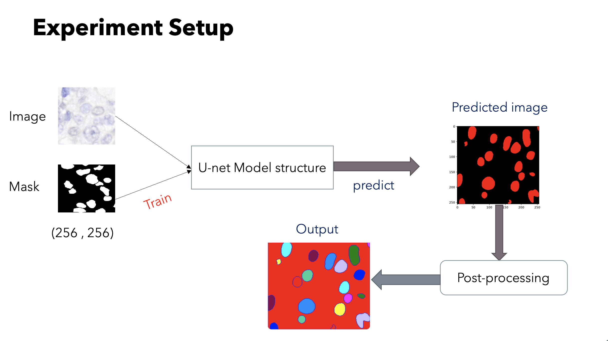
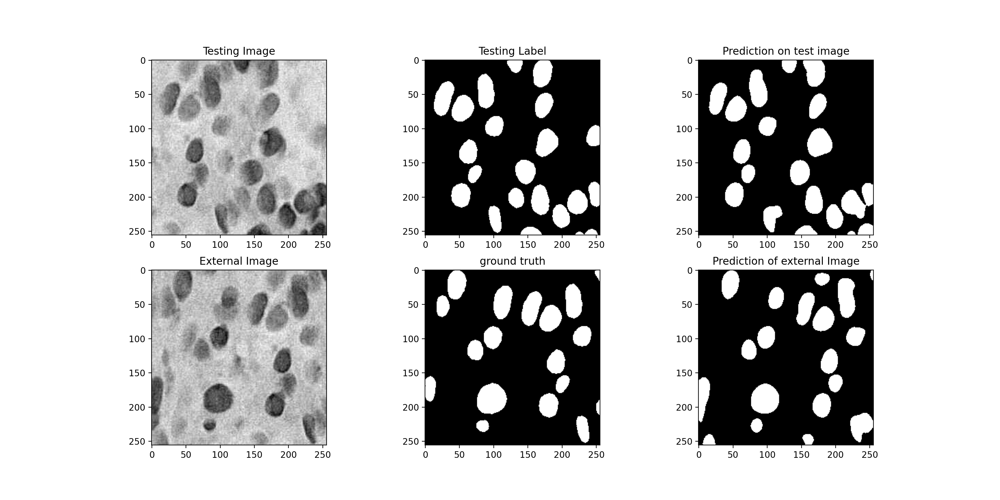

# Nuclei Semantic Segmentation on Staining Images using TensorFlow-Keras

## Overview
This project implements semantic segmentation for identifying and segmenting cell nuclei in medical staining images using TensorFlow and Keras. The implementation uses deep learning techniques to accurately detect and segment nuclei boundaries, which is crucial for various biomedical applications and research.

## Features
- Semantic segmentation of cell nuclei in histology images
- Support for multiple staining types (H&E, IHC, IF)
- Data augmentation pipeline for robust training
- U-Net architecture implementation with TensorFlow/Keras
- Performance metrics calculation (IoU, Dice coefficient)
- Visualization tools for segmentation results

## Prerequisites
```bash
Python 3.7+
TensorFlow 2.x
Keras
OpenCV
NumPy
Matplotlib
Scikit-learn
Pillow
```

## Installation
1. Clone the repository:
```bash
git clone https://github.com/yourusername/Nuclei-Semantic-Segmentation.git
cd Nuclei-Semantic-Segmentation
```
## Dataset Structure
The dataset should be organized as follows:
```
dataset/
├── train/
│   ├── images/
│   │   └── image_*.png
│   └── masks/
│       └── mask_*.png
├── validation/
│   ├── images/
│   │   └── image_*.png
│   └── masks/
│       └── mask_*.png
└── test/
    ├── images/
    │   └── image_*.png
    └── masks/
        └── mask_*.png
```

## Model Architecture
The implementation uses a modified U-Net architecture with the following key components:
- Encoder: Convolutional layers with max pooling
- Decoder: Transposed convolutions with skip connections
- Final layer: 1x1 convolution with sigmoid activation

## Inference
To run inference on new images:
```bash
python predict.py --image_path path/to/image --model_path path/to/model
```

1. 

2. 

3. 
